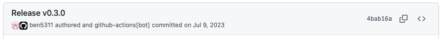

# Push Changes from GitHub Actions

## Push to a Feature Branch

If you want to push to a feature branch, you can use the builtin [**GITHUB_TOKEN**](https://docs.github.com/en/actions/security-for-github-actions/security-guides/automatic-token-authentication#about-the-github_token-secret).
Make sure that it has the `contents: write` permission.

```bash
git add changed-file.txt

if git diff --cached --quiet; then
  echo "No changes to commit, exiting"
  exit 0
fi

echo "Committing changes"
# Set committer name and email
git config user.name  "github-actions[bot]"
git config user.email "github-actions[bot]@users.noreply.github.com"
# If you want to skip workflow runs for the commit, add [skip ci] to the message
git commit -m "Release v0.3.0 [skip ci]"
# If you want to mark the GitHub user that triggered the workflow as author
git commit -m "Release v0.3.0" --author="${GITHUB_ACTOR} <${GITHUB_ACTOR_ID}+${GITHUB_ACTOR}@users.noreply.github.com>"

echo "Pushing changes to branch '$GITHUB_REF_NAME'"
git push "https://${{ secrets.GITHUB_TOKEN }}@github.com/${GITHUB_REPOSITORY} HEAD:${GITHUB_REF_NAME}"
```



## Push to a Protected Branch

If you want to push to a protected branch, such as **main**, you can't use the builtin GITHUB_TOKEN, because branch
protection rules apply and it's not possible to bypass these rules for it.

There are two solutions to this:

1. Create an [SSH deploy key](https://docs.github.com/en/authentication/connecting-to-github-with-ssh/managing-deploy-keys#deploy-keys)
  for the repository and bypass the branch protection rules for it.
  You can create a separate deploy key for each repository (following a least privilege approach).

2. Create a technical [GitHub user](https://docs.github.com/en/authentication/connecting-to-github-with-ssh/managing-deploy-keys#machine-users),
  bypass the branch protection rules for it and create a [Personal Access Token (PAT)](https://docs.github.com/en/authentication/keeping-your-account-and-data-secure/managing-your-personal-access-tokens)
  for this user.
    * A [classic PAT](https://docs.github.com/en/authentication/keeping-your-account-and-data-secure/managing-your-personal-access-tokens#types-of-personal-access-tokens)
      can access all repositories that the user has access to.
    * A [fine-grained PAT](https://docs.github.com/en/authentication/keeping-your-account-and-data-secure/managing-your-personal-access-tokens#types-of-personal-access-tokens)
      can be limited to a specific repository. However, if Single Sign-On (SSO) is enabled, you can't create it without
      the approval of the GitHub organization.

### Create an SSH Deploy Key

First, generate an SSH key-pair on your machine:

```bash
ssh-keygen -t ed25519 -C "https://github.com/my-github-org/my-repository"
```

Go to [github.com/my-github-org/my-repository/settings/keys/new](https://github.com/my-github-org/my-repository/settings/keys/new)
to authorize the new deploy key for the repository:

```text
Title: GitHub Actions github.com/my-github-org/my-repository
Key: <Insert the newly generated PUBLIC KEY>
[x] Allow write access
```

Go to [github.com/my-github-org/my-repository/secrets/actions/new](https://github.com/my-github-org/my-repository/secrets/actions/new)
to add the GitHub Actions secret:

```text
Name: SSH_DEPLOY_KEY
Secret: <Insert the newly generated PRIVATE KEY>
```

You can now use the deploy key in your workflow to push changes to the main branch:

```yaml

jobs:
  push-changes:
    runs-on: ubuntu-latest
    steps:
      - uses: actions/checkout@v4
        with:
          ssh-key: ${{ secrets.SSH_DEPLOY_KEY }}

      - name: Push changes
        run: |
          git add changed-file.txt

          if git diff --cached --quiet; then
            echo "No changes to commit, exiting"
          else
            echo "Committing changes"
            git config user.name  "github-actions[bot]"
            git config user.email "github-actions[bot]@users.noreply.github.com"
            git commit -m "Release v0.3.0 [skip ci]"

            echo "Pushing changes to main branch"
            git push origin HEAD:main
          fi
```
