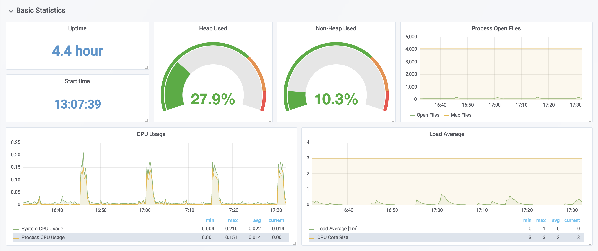
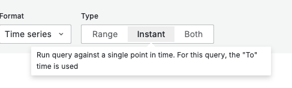

# Grafana

[Grafana](https://grafana.com/) is a monitoring tool that allows you to create dashboards to monitor the health
of your systems, services and applications.
A dashboard visualizes metrics of the service, such as CPU usage, memory usage, requests per second, and error counts.



<https://grafana.com/grafana/dashboards/6756-spring-boot-statistics>

[Prometheus](https://prometheus.io/) is a metrics scraper that pulls metrics from your applications and acts as a data source for Grafana.


## Resources

* [Grafana Documentation](https://grafana.com/docs/grafana/latest/) -
  Latest Grafana documentation.
* [Prometheus Documentation](https://prometheus.io/docs/prometheus/latest/getting_started/) -
  Latest Prometheus documentation.
* [local-setup](./local-setup/) -
  A docker compose file to quickly set up a Grafana and a Prometheus instance.

## Counter Metrics

When you want to display the increase of a counter metric in Grafana with `increase(metric[$__rate_interval])`,
you need to ensure that the rate interval used by Grafana is larger than the scrape interval of Prometheus.
Otherwise, you always get a **no data** result for mathematical reasons.

According to [the docs](https://grafana.com/docs/grafana/latest/datasources/prometheus/template-variables/#use-__rate_interval),
Grafana should automatically take care of this if the Prometheus connector is properly configured.

## PromQL Examples

[PromQL](https://prometheus.io/docs/prometheus/latest/querying/basics/) is the query language used to fetch data from
Prometheus.

### Availability

For each connected service, Prometheus stores a **up** time series. It is **1** if the instance is healthy,
i.e. reachable, or **0** if the scrape failed. It is useful for instance availability monitoring.
See <https://prometheus.io/docs/concepts/jobs_instances>.

```js
avg(avg_over_time(up{kubernetes_namespace="$namespace", name="$service", instance="$service.$namespace.svc:80"}[$__range]))
```

### Kubernetes Pod Memory Consumption

```js
sum by (pod)(container_memory_usage_bytes{namespace="$namespace"})
```

### Kubernetes Pod Instances Count

```js
sum(kube_pod_container_status_running{namespace="$namespace", container="$service"})
sum(kube_deployment_status_replicas_unavailable{namespace="$namespace", deployment="$deployment"})
```

### Kubernetes Cronjob Seconds Since Last Successful Run

```js
time() - kube_cronjob_status_last_successful_time{namespace="$namespace", cronjob="$cronjob_name"}
```

It makes sense to display elapsed time in a Grafana [Stat panel](https://grafana.com/docs/grafana/latest/panels-visualizations/visualizations/stat/).

When doing so, you should use the **Instant** query mode. Otherwise, the displayed value depends on the selected query
interval, and changing the interval makes the value jump because the query is evaluated at different step boundaries.



### Java Service Uptime in Seconds

```js
min(process_uptime_seconds{kubernetes_namespace="$namespace", name="$service", instance=~"$instance"})
```

### Java Service Resource Consumption

```js
sum(system_cpu_usage{kubernetes_namespace="$namespace", name="$service", instance=~"$instance"})
sum(jvm_memory_used_bytes{kubernetes_namespace="$namespace", name="$service", instance=~"$instance"})
sum(jvm_memory_max_bytes{kubernetes_namespace="$namespace", name="$service", instance=~"$instance"})
```

### Java Service Requests

Incoming Requests

```js
sum by (outcome) (increase(http_server_requests_seconds_count{kubernetes_namespace="$namespace", name="$service", instance=~"$instance", uri=~"$incoming_endpoint", client_name=~"$client_name"}[$__rate_interval]))
```

Outgoing Requests

```js
sum by (outcome) (increase(http_client_requests_seconds_count{kubernetes_namespace="$namespace", name="$service", instance=~"$instance", uri=~"$outgoing_endpoint"}[$__rate_interval]))
```

Response time

```js
sum(increase(http_server_requests_seconds_sum{kubernetes_namespace="$namespace", name="$service", instance=~"$instance", uri=~"$incoming_endpoint", client_name=~"$client_name"}[$__rate_interval]))
/
sum(increase(http_server_requests_seconds_count{kubernetes_namespace="$namespace", name="$service", instance=~"$instance", uri=~"$incoming_endpoint", client_name=~"$client_name"}[$__rate_interval]))
```
